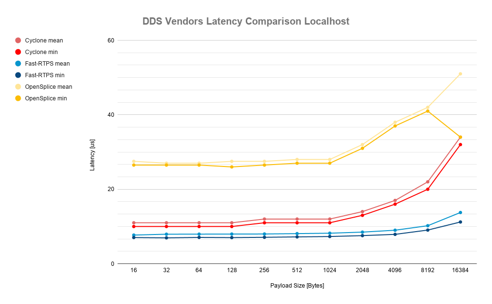
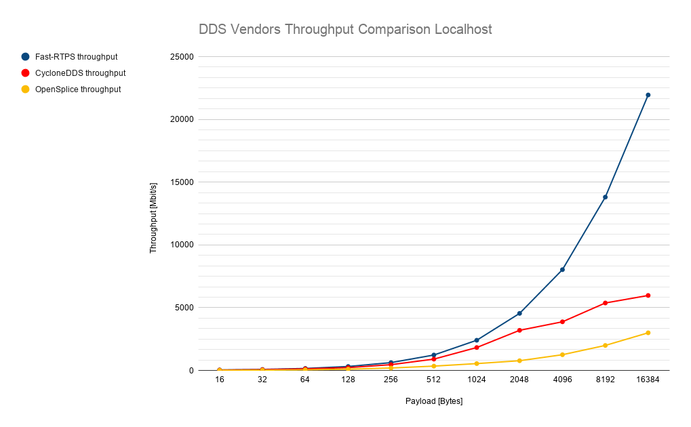

# Benchmarking
This repository contains the performance results and comparisons obtained by eProsima using different testing tools. Our aim is to gather performance results for different DDS implementations and versions so their performance can be easily compared.

## DDS vendors comparison
We execute and compare performance test for different DDS implementations ([Fast-RPTS](https://github.com/eProsima/Fast-RTPS), [CycloneDDS](https://github.com/eclipse-cyclonedds/cyclonedds), and [OpenSplice](https://github.com/ADLINK-IST/opensplice)), using the performance testing tools provided by each vendor. We look at performance in terms of:

* [Latency](performance_results/dds_vendors_comparisons/latency)
* [Throughput](performance_results/dds_vendors_comparisons/throughput)

With the purpose of repeatability, each test case contains a description of the executed experiments, detailing the testing environment and configuration, as well as the software versions and any other information required to replicate the experiment.

### Results
An article on the latency performance of Fast-RTPS, CycloneDDS, and OpenSplice can be found [here](https://www.eprosima.com/index.php/resources-all/performance/fast-rtps-vs-cyclone-dds). The following constitute an example of such reports: one for latency and another one for throughput, both in the localhost test case (publisher and subscriber share machine but not process).

#### Latency Comparison Localhost

*[Latency comparison](performance_results/dds_vendors_comparisons/latency/localhost/comparisons/2019-09-23_07-28-16.png) between Fast-RTPS ([010ac53](https://github.com/eProsima/Fast-RTPS/commits/010ac536619f02c63b380658059d1f98ed50e964)), CycloneDDS ([801c4b1](https://github.com/eclipse-cyclonedds/cyclonedds/commits/801c4b14566a15c08261818a1192b1d16d055d8e)) and OpenSplice (v6.9)*

#### Throughput Comparison Localhost

*[Throughput comparison](performance_results/dds_vendors_comparisons/throughput/localhost/comparisons/2019-11-04_15-39-11.png) between Fast-RTPS ([0bcafbd](https://github.com/eProsima/Fast-RTPS/commits/0bcafbde1c6fa3ef7285819980f932df910dba61)), CycloneDDS ([aa5236d](https://github.com/eclipse-cyclonedds/cyclonedds/commits/aa5236dea46b82e6db26a0c87b90cedeca465524)) and OpenSplice (v6.9)*

## Fast-RTPS cross-version comparison
To keep track of our own library's progress, we execute cross-version performance comparisons in terms of [Latency](performance_results/fastrtps/latency).

#### v1.9.2-v1.9.3 Latency Cross-Comparison Localhost

#### v1.9.2-v1.9.3 Latency Cross-Comparison Same Process

