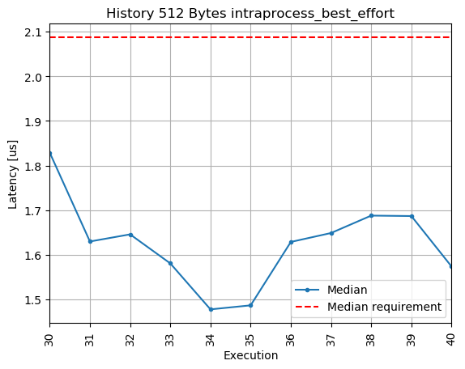

# Benchmarking
This repository contains the performance results and comparisons obtained by eProsima using different testing tools. Our aim is to gather performance results for different DDS implementations and versions so their performance can be easily compared.

* [Fast-RTPS Automated Benchmark](#fast-rtps-automated-benchmark)
* [DDS Vendors Comparison](#dds-vendors-comparison)
* [Fast-RTPS Cross-Version Comparison](#fast-rtps-cross-version-comparison)
* [iRobot Performance Tests](#irobot-performance-tests)

## Fast-RTPS Automated Benchmark

[Fast-RTPS Automated Benchmark](fastrtps_automated_benchmark) provides a framework to automate the execution of performance tests for Fast-RTPS that is easy to deploy and integrate with Continuos Integration (CI) pipelines.
The main goal is to ease the deployment and execution of performance test runs, generating reports that can be shared and used to evaluate Fast-RTPS' performance from various angles.

The following is an example of one of the many plots generated for the case of Latency tests.
It shows the evolution of Fast-RTPS' latency median performance when sending messages of 512 Bytes between a publisher and a subscriber in the same process when the reliability is set to `BEST_EFFORT`.

## DDS Vendors Comparison
We execute and compare performance test for different DDS implementations ([Fast-RPTS](https://github.com/eProsima/Fast-RTPS), [CycloneDDS](https://github.com/eclipse-cyclonedds/cyclonedds), and [OpenSplice](https://github.com/ADLINK-IST/opensplice)), using the performance testing tools provided by each vendor. We look at performance in terms of:

* [Latency](performance_results/dds_vendors_comparisons/latency)
* [Throughput](performance_results/dds_vendors_comparisons/throughput)

With the purpose of repeatability, each test case contains a description of the executed experiments, detailing the testing environment and configuration, as well as the software versions and any other information required to replicate the experiment.

### Results
An article on the latency performance of Fast-RTPS, CycloneDDS, and OpenSplice can be found [here](https://www.eprosima.com/index.php/resources-all/performance/fast-rtps-vs-cyclone-dds). The following constitute an example of such reports: one for latency and another one for throughput, both in the localhost test case (publisher and subscriber share machine but not process).

#### Latency Comparison Localhost

*[Latency comparison](performance_results/dds_vendors_comparisons/latency/localhost/comparisons/2019-09-23_07-28-16.png) between Fast-RTPS ([010ac53](https://github.com/eProsima/Fast-RTPS/commits/010ac536619f02c63b380658059d1f98ed50e964)), CycloneDDS ([801c4b1](https://github.com/eclipse-cyclonedds/cyclonedds/commits/801c4b14566a15c08261818a1192b1d16d055d8e)) and OpenSplice (v6.9)*

#### Throughput Comparison Localhost

*[Throughput comparison](performance_results/dds_vendors_comparisons/throughput/localhost/comparisons/2019-11-04_15-39-11.png) between Fast-RTPS ([0bcafbd](https://github.com/eProsima/Fast-RTPS/commits/0bcafbde1c6fa3ef7285819980f932df910dba61)), CycloneDDS ([aa5236d](https://github.com/eclipse-cyclonedds/cyclonedds/commits/aa5236dea46b82e6db26a0c87b90cedeca465524)) and OpenSplice (v6.9)*

## Fast-RTPS Cross-Version Comparison
To keep track of our own library's progress, we execute cross-version performance comparisons in terms of [Latency](performance_results/fastrtps/latency).

#### v1.9.2-v1.9.3 Latency Cross-Comparison Localhost

#### v1.9.2-v1.9.3 Latency Cross-Comparison Same Process

## iRobot Performance Tests
iRobot has created a [benchmark application](https://github.com/irobot-ros/ros2-performance/) to test the performance of ROS 2 in terms of latency, memory consumption, and CPU usages.
This repository, not only contains tool for performance testing, but also a detail guide on how to cross-compile ROS 2 for a RaspberryPi 3b+ with Raspbian.
We use that tool to characterize the different vendors' performance on a RaspberryPi 3b+.
[Here](performance_results/irobot_tests/rpi_raspbian/README.md), you can find the experiments log, with a detail description of testing environment and configuration, as well as software versions tested.
To ease the configuration of the experiments for different test-cases, a set of [utilities](scripts/irobot_tests) for the iRobot performance tests has been created.

### RaspberryPi 3b+ latest results
###### Fast-RTPS Mont Blanc topology

###### Fast-RTPS eProsima topology

