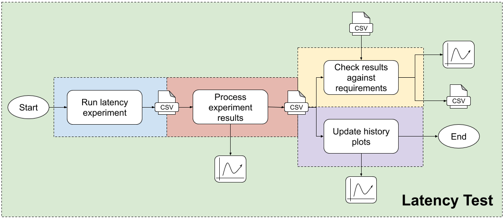
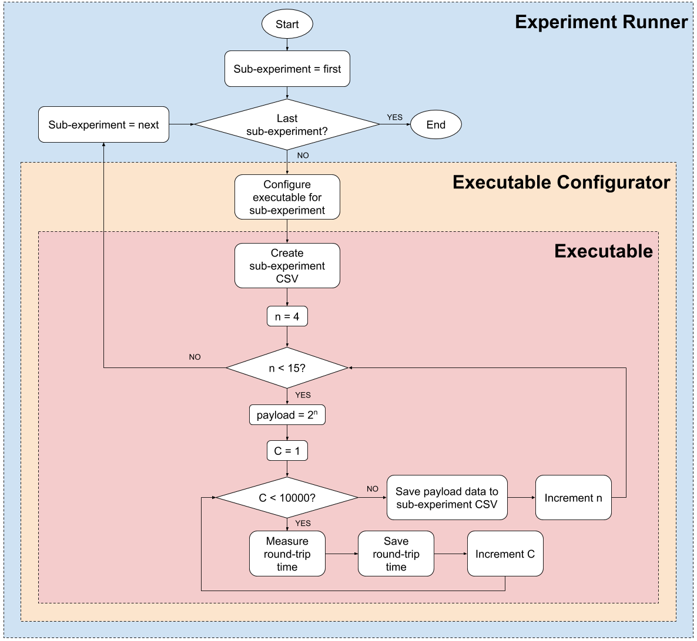
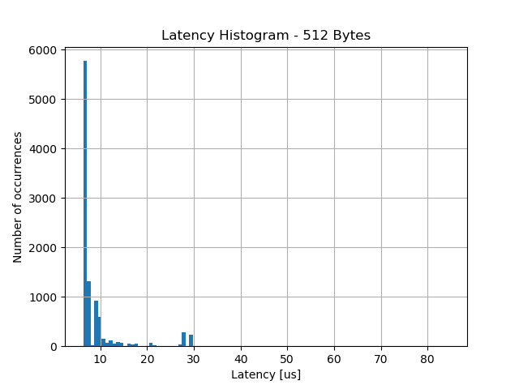
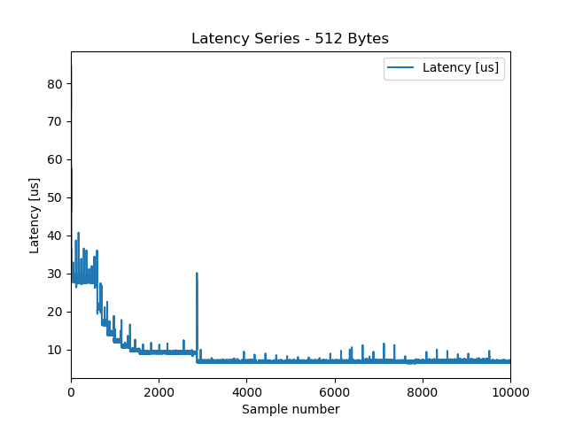
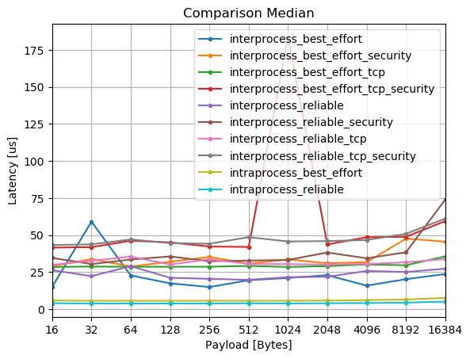
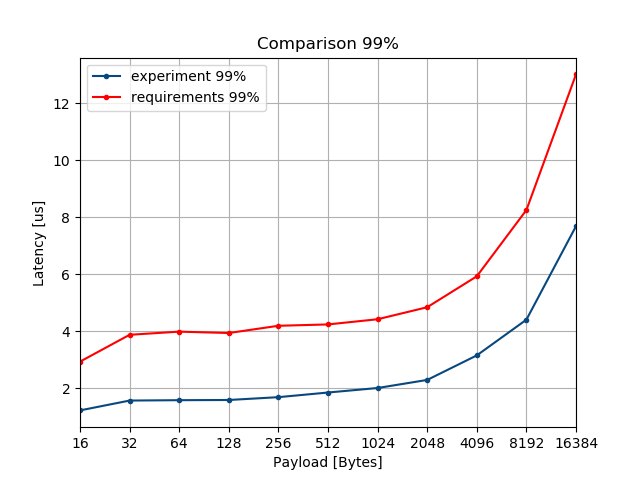
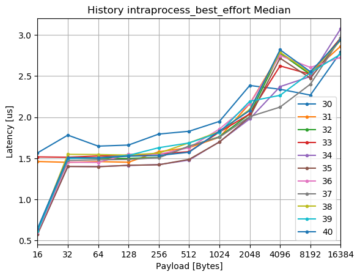
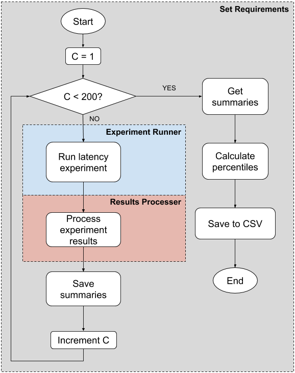
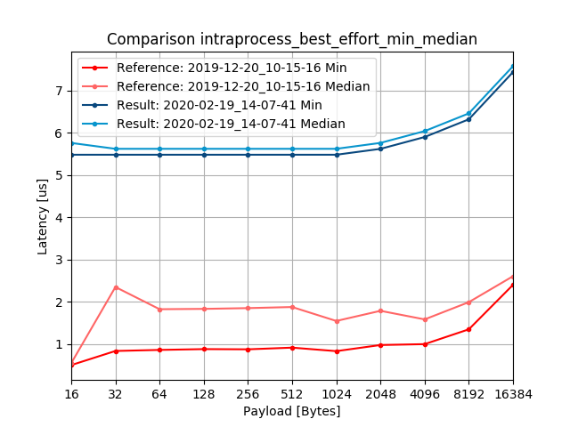

# Latency Performance Test Specification

Performing a latency test consists of a sequence of steps, from running an experiment to analyzing and presenting the results.
This document describes, for each of those steps, what are the inputs and outputs, and how the operation should be performed.
The steps involved in running a Latency Performance Test are:

1. [Run a latency experiment](#run-a-latency-experiment): This step consists in taking measurements for different test cases (henceforth referred to as sub-experiments).
It outputs CSV files with all the taken measurements.
1. [Process experiment results](#process-experiment-results): Taking the measurements CSV files from the previous step, create summaries (as CSV files), histograms, and time series.
1. [Check the results against requirements](#check-the-results-against-requirements): Use the summaries to validate results against requirements, saving the results as "check" plots and CSV files.
1. [Update history plots](#update-history-plots): Use the summaries to create historical plots that use data from different experiments to illustrate Fast-RTPS' latency performance throughout the development.

This, can be represented in the following diagram:

_Figure 1: Latency test operation flow_

In addition, this document provides instructions on how to derive latency requirements for a specific platform, as well as on how to compare experiment results.

* [Set Latency Requirements](#set-latency-requirements)
* [Compare Experiments](#compare-experiments)

## Run a Latency Experiment

Running a latency experiment consists in measuring the roundtrip time of 10000 messages for every sub-experiment and payload considered.
The result must be one CSV file for each sub-experiment, containing the latency measurements for each payload.

#### Sub-experiments
The 10 sub-experiment considered are:

|| Name | Transport | Reliability | Security |
|-|-|-|-|-|
| 1 | intraprocess_best_effort | intra-process | BEST EFFORT | NO |
| 2 | intraprocess_reliable | intra-process | RELIABLE | NO |
| 3 | interprocess_best_effort | UDPv4 | BEST EFFORT | NO |
| 4 | interprocess_best_effort_security | UDPv4 | BEST EFFORT | YES |
| 5 | interprocess_best_effort_tcp | TCPv4 | BEST EFFORT | NO |
| 6 | interprocess_best_effort_tcp_security | TCPv4 | BEST EFFORT | YES |
| 7 | interprocess_reliable | UDPv4 | RELIABLE | NO |
| 8 | interprocess_reliable_security | UDPv4 | RELIABLE | YES |
| 9 | interprocess_reliable_tcp | TCPv4 | RELIABLE | NO |
| 10 | interprocess_reliable_tcp_security | TCPv4 | RELIABLE | YES |

#### Payloads
The payloads used to characterize Fast-RTPS latency performance are:

```math
payloads = \{a \mid a = 2^n,  n \in \N \wedge n \in [4, 14]\}
```

### Experiment Stack
The experiment is perform using three different agents:

* __Executable__: Fast-RTPS' `LatencyTest`.
It takes a configuration (in the form of a Fast-RTPS XML file), and measures roundtrip time for a set of payloads.
* __Executable configurator__: Fast-RTPS' `latency_tests.py`.
A python utility to configure and launch `LatencyTest`.
This is used, in combination with CMake and `c-test`, to create a series of `performance.latency` tests.
* __Experiment runner__: [latency_run_experiment.bash](latency_run_experiment.bash).
Utility to execute a latency experiment.
Under the hood, this runs the following command (and copies the results to the specified directory):

    ```bash
    colcon test \
        --packages-select fastrtps \
        --ctest-args -R performance.latency
    ```

    `colcon test` in turn calls to the executable configurator `latency_tests.py` once for each experiment type described in [Sub-experiments](#sub-experiments).

A high level diagram of a latency experiment stack is as follows:

_Figure 2: Latency experiment stack_

### Latency Executable Specifications [TODO]


### Latency Measurements CSV Specification

Each execution of `LatencyTest` produces a CSV file with the following characteristics:

* The measurements CSV file must be a comma separated file
* It must have a header with the following columns:
    * Sample
    * Payload [Bytes]
    * Latency [us]
* It must have one entry per measurement.
* The floating point precision must be 3 digits.

##### Measurements CSV example

```
Sample,Payload [Bytes],Latency [us]
1,16,2.05575
2,16,1.65225
3,16,1.55675
[...]
```

### How To Run An Experiment

[latency_run_experiment.bash](latency_run_experiment.bash) utility can be used to execute the stack illustrated in _Figure 2_.

```bash
bash latency_run_experiment.bash \
    -c <fastrtps_ws> \
    -r <experiment_results_dir>
```

_Note_: `fastrtps_ws` is expected to be a `colcon` workspace with Fast-RTPS built and installed.
This is because [latency_run_experiment.bash](latency_run_experiment.bash) executes a `colcon test` command to run the experiment.

## Process Experiment Results

Processing latency experiment results consist on four tasks:

* [Create sub-experiment summaries](#create-sub-experiment-summaries)
* [Create sub-experiment latency histograms](#create-sub-experiment-latency-histograms)
* [Create sub-experiment time-series plots](#create-sub-experiment-time-series-plots)
* [Create sub-experiment comparison plots](#create-sub-experiment-comparison-plots)

### Create sub-experiment summaries

For each sub-experiment measurements CSV file, a sub-experiment summary must be created as a CSV. upholding the following:

#### Latency Summary CSV Specification

* The summary CSV file must be a comma separated file
* It must have a header with the following columns:
    * Bytes: The payload in Bytes
    * Samples: The number of measurements taken for that payload
    * Max: The maximum latency for that payload
    * Min: The minimum latency for that payload
    * Mean: The mean latency for that payload
    * Median: The median latency for that payload
    * Stdev: The standard deviation of the latency for that payload
    * Mean jitter: The mean jitter for that payload
    * Max jitter: The max jitter for that payload
    * 90%: The percentile 90 for that payload
    * 99%: The percentile 99 for that payload
    * 99.99%: The percentile 99.99 for that payload
* It must have one entry per payload.
* The floating point precision must be 3 digits.

##### Summary CSV example

```
Bytes,Samples,Max,Min,Mean,Median,Stdev,Mean jitter,Max jitter,90%,99%,99.99%
16,10000,12.577,0.590,0.767,0.610,0.502,0.018,10.968,1.608,2.962,9.983
32,10000,12.225,1.152,1.500,1.497,0.279,0.027,10.757,1.521,2.785,8.335
64,10000,11.501,1.165,1.487,1.505,0.263,0.025,9.999,1.530,2.804,5.646
128,10000,12.096,1.177,1.573,1.535,0.304,0.030,10.478,1.639,3.009,8.701
256,10000,12.703,1.028,1.582,1.629,0.362,0.032,9.858,1.660,3.188,11.376
512,10000,12.390,1.073,1.658,1.687,0.358,0.034,10.706,1.720,3.342,9.509
1024,10000,13.864,1.150,1.754,1.813,0.387,0.034,11.887,1.850,3.523,8.961
2048,10000,13.835,1.140,1.977,2.194,0.571,0.042,11.451,2.381,4.182,10.943
4096,10000,18.620,1.298,2.342,2.266,0.798,0.050,13.595,3.062,5.025,11.612
8192,10000,16.602,1.456,2.854,2.541,1.176,0.049,12.154,4.177,6.395,11.520
16384,10000,22.180,2.517,4.056,2.768,2.229,0.057,14.522,8.251,8.364,15.590
```

### Create sub-experiment latency histograms

For each payload in each sub-experiment measurements CSV file, a latency histogram must be created.
This is done to inspect the shape of the latency distributions.


_Figure 3: Latency histogram_

### Create sub-experiment time-series plots

For each payload in each sub-experiment measurements CSV file, a latency time-series plot must be created.
This is done to inspect the fluctuations on the measurements.


_Figure 4: Latency time-series_

### Create sub-experiment comparison plots

Plots illustrating a comparison between the different sub-experiments performance in terms of minimum, maximum, median, and 99 percentile latency must be created.
This is done to spot performance differences between the different sub-experiments.


_Figure 4: Sub-experiments latency median comparison_

### How To Process Experiment Results

[latency_process_results.py](latency_process_results.py) utility can be used to process the results of a latency experiment.
It takes a sub-experiment measurements CSV as input, and produces histograms, time-series plots, and a summary of that sub-experiment.

```bash
python3 latency_process_results.py \
    --plots_directory <directory> \
    --raw_csv <sub-experiment_measurements_csv> \
    --output_csv <summary_filename>
```

Then, [latency_compare_subexperiments.py](latency_compare_subexperiments.py) utility can be used to generate comparison plots for minimum, maximum, median, and 99% percentile latency performance across a list of sub-experiments specified by their summaries.

```bash
python3 latency_compare_subexperiments.py \
    --plots_directory <dir_for_plots> \
    --subexperiment_summaries <summary_1.csv> <summary_2.csv> ...
```

## Check The Results Against Requirements

To evaluate whether the latency performance of Fast-RTPS is satisfactory, experiment results must be checked against a set of requirements.
For every sub-experiment and payload, there must be a requirement for each of the following categories:

* __Latency median__: Since the latency distribution are not expected to be normal (they are in fact very right-skewed), the median is preferred to the mean as a central measurement, since is not highly affected by outliers.
The experiment medians must always be below the limit set by the requirement.
* __Latency maximum__: The experiment maxima must be below the limit set by the requirement.
* __Latency 99 percentile__: The experiment 99 percentiles must always be below the limit set by the requirement. This requirement is set to allow some outliers in the experiment.

The sub-experiment summaries are used to check experiment's data against requirements extracted from a requirements CSV file (in the form described in [Requirements CSV specification](#requirements-csv-specification)).
Checking latency results against requirements consist on two tasks:

* [Create sub-experiment check reports](#create-sub-experiment-check-reports)
* [Create sub-experiment check plots](#create-sub-experiment-check-plots)

### Create sub-experiment check reports

A sub-experiment check report is a CSV file containing three requirement checks for each payload (median, maximum, and 99 percentile).
The sub-experiment check report CSV files must uphold the [Check report CSV specification](#check-report-csv-specification).

### Create sub-experiment check plots

For each sub-experiment and check, there must be a check plot that displays the sub-experiment results alongside their corresponding requirements.
These plots must have the following form:


_Figure 6: Check plot_

### Requirements CSV specification

* The requirements CSV file must be a comma separated file
* It must have a header with the following columns:
    * Experiment type
    * Bytes
    * Median
    * 99%
    * Max
* It must have one entry per combination of sub-experiment and payload.
* The floating point precision must be 3 digits.

##### Requirements CSV example

```
Experiment type,Bytes,Median,99%,Max
interprocess_best_effort_security,16,29.706,85.156,504.453
interprocess_best_effort_security,32,51.346,135.733,504.408
interprocess_best_effort_security,64,51.001,137.385,507.132
[...]
```

### Check report CSV specification

A check report is a CSV file containing information about how a certain sub-experiment has performed relative to a set of requirements.
The specifications for such file are:

* It must be a comma separated file
* It must have a header with the following columns:
    * Check: Median, 99%, or Max
    * Bytes: The payload in Bytes
    * Requirement: The limit
    * Experiment: The data
    * Difference: The absolute difference between `Requirement` and `Experiment`.
    * Percentage over requirement: How much of the requirement does the difference represent (in percentage).
    * Status: Either passed or failed.
* It must have one entry per payload and check.
* The floating point precision must be 3 digits.

##### Check report CSV example

```
Check,Bytes,Requirement,Experiment,Difference,Percentage over requirement,Status
Median,16,1.609,0.646,0.963,-59.851,passed
Median,32,1.958,1.509,0.449,-22.932,passed
Median,64,1.955,1.505,0.450,-23.018,passed
Median,128,1.985,1.526,0.459,-23.123,passed
Median,256,1.992,1.534,0.458,-22.992,passed
Median,512,2.087,1.574,0.513,-24.581,passed
Median,1024,2.207,1.832,0.375,-16.991,passed
Median,2048,2.504,2.081,0.423,-16.893,passed
Median,4096,2.887,2.820,0.067,-2.321,passed
Median,8192,2.768,2.554,0.214,-7.731,passed
Median,16384,3.060,2.943,0.117,-3.824,passed
99%,16,2.939,1.230,1.709,-58.149,passed
99%,32,3.881,1.575,2.306,-59.418,passed
99%,64,3.991,1.588,2.403,-60.210,passed
99%,128,3.943,1.595,2.348,-59.549,passed
99%,256,4.197,1.694,2.503,-59.638,passed
99%,512,4.244,1.857,2.387,-56.244,passed
99%,1024,4.426,2.015,2.411,-54.474,passed
99%,2048,4.847,2.298,2.549,-52.589,passed
99%,4096,5.931,3.158,2.773,-46.754,passed
99%,8192,8.254,4.410,3.844,-46.571,passed
99%,16384,13.010,7.688,5.322,-40.907,passed
Max,16,94.066,7.926,86.140,-91.574,passed
Max,32,451.388,12.795,438.593,-97.165,passed
Max,64,425.019,11.695,413.324,-97.248,passed
Max,128,69.307,18.207,51.100,-73.730,passed
Max,256,47.045,11.123,35.922,-76.357,passed
Max,512,44.790,15.487,29.303,-65.423,passed
Max,1024,45.540,15.692,29.848,-65.542,passed
Max,2048,41.331,12.247,29.084,-70.368,passed
Max,4096,45.595,16.501,29.094,-63.810,passed
Max,8192,47.847,14.991,32.856,-68.669,passed
Max,16384,62.676,18.416,44.260,-70.617,passed
```

### How To Check Results Against Requirements

[latency_check_experiment.py](latency_check_experiment.py) utility can be used to check the results of a latency experiment against a set of requirements.
It takes a set of sub-experiment summaries and a requirements CSV file as input, and produces check reports and plots for each sub-experiment.

```bash
python3 latency_check_experiment.py \
    --requirements <requirements_csv> \
    --experiment_directory <dir_with_summaries> \
    --plots_directory <dir_for_plots> \
    --print_summaries
```

## Update History Plots

As a last step of the latency testing process, history plots must be created to visualize Fast-RTPS latency performance throughout the development process.
There are two types of such plots:

* [Magnitude history plots](#magnitude-history-plots)
* [Payload history plots](#payload-history-plots)

### Magnitude history plots

Using summaries from different latency tests, magnitude history plots must be created.
There must be one magnitude history plot (in the form of _Figure 7_) for each of the following magnitudes:

* Latency minimum
* Latency median
* Latency maximum
* Latency 99 percentile


_Figure 7: Magnitude history plot_

### Payload history plots

Using summaries from different latency tests, one plot for each sub-experiment, requirement, and payload must be created in the following form:


_Figure 8: Payload history plot_

### How To Update History Plots

[latency_plot_history.py](latency_plot_history.py) utility can be used to generate latency test history plots.
It takes a set of experiment results and a requirements CSV file as input, and produces history magnitude and history plots.

```bash
python3 latency_plot_history.py \
    --requirements <requirements_csv> \
    --experiments_results <dir_with_experiment_results_dirs> \
    --plots_directory <dir_for_plots>
```

## Set Latency Requirements

Although requirements may come from application specifications, for the purpose of monitoring latency performance as development happens, a method to extrapolate requirements based on testing environment is presented here.

This is necessary because although at eProsima there are not hard application driven latency requirements, there is an interest in monitoring how Fast-RTPS latency performance evolves with development, and therefore there is a need of a way to determine if Fast-RTPS is getting better or worse.
To do that, performance requirements must be set for the different cases based on how the library performs, in a specific hardware setup, at a given point in time.
This is a characterization of the performance state for a specific software version.
That characterization is used as reference (requirements) to monitor Fast-RTPS evolution.

This is done by selecting a specific Fast-RTPS commit, and collecting latency data several times (200).
Then, requirements are set for some of the measured magnitudes, fixed as the measured data at a given percentile, saving them into a CSV file.
Requirements are set for (for each experiment type and payload):

| Magnitude | Percentile |
|-|-|
| Median | 99 |
| Maximum | 99 |
| 99 percentile | 99 |

The method for setting requirements is illustrated in the following diagram:

_Figure 9: Set requirements process_

As long as a experiment execution is under those requirements, Fast-RTPS' performance is considered good enough.

### Utilities

Two utilities are created to perform this task:

* [latency_determine_requirements.py](latency_determine_requirements.py): Script to determine latency requirements based on a set of experiment results.
* [latency_extrapolate_requirements.bash](latency_extrapolate_requirements.bash): Script to run several latency experiments, and then use [latency_determine_requirements.py](latency_determine_requirements.py) to derive requirements.

#### How To Set Latency Requirements

To derive latency requirements for a given set up, run:
```bash
bash latency_extrapolate_requirements.bash \
    -c <fastrtps_ws> \
    -o requirements.csv \
    -r runs_for_requirementsSet
```

This produces a requirements CSV as specified in [Requirements CSV specification](#requirements-csv-specification)
After that, the CSV file can be edited to adjust requirements at will.

## Compare Experiments

[latency_compare_experiments.py](latency_compare_experiments.py) utility can be used to compare the results of two different experiments, one acting as reference, and the other one as target for the comparison.
The utility compares (using the summaries output by [latency_process_results.py](latency_process_results.py)) the results of the target against the reference in terms of latency minima, median, 99 percentile, and maxima, generates comparison plots (min-median, max-99%), and creates comparison CSVs (stored in the plots directory).
The exit code is 0 if all performed comparisons succeed, and 1 otherwise.

```bash
python3 latency_compare_experiments.py \
    --reference <reference_results_dir> \
    --results <target_result_dir> \
    --plots_directory <dir_for_plots>
```

For each sub-experiment present in both reference and target experiments, the utility generates a *min-median* and a *max-99 percentile* comparison plot.


_Figure 10: Min-Median comparison of two different experiments (intra-process best effort sub-expeirment)_

Furthermore, for each sub-experiment present in both reference and target experiments, the utility generates a CSV file containing the data of both sub-experiments:

###### intraprocess_best_effort_comparison.csv
```
Bytes,Samples,Max,Min,Mean,Median,Stdev,Mean jitter,Max jitter,90%,99%,99.99%,Label
16,10000,23.144,0.503,0.578,0.549,0.291,0.056,22.590,0.637,0.923,10.276,Reference: 2019-12-20_10-15-16
32,10000,355.272,0.837,2.049,2.350,5.865,0.264,352.825,2.733,2.894,354.963,Reference: 2019-12-20_10-15-16
64,10000,404.363,0.862,2.098,1.825,6.043,0.261,401.624,2.769,3.294,387.561,Reference: 2019-12-20_10-15-16
128,10000,236.625,0.881,2.046,1.833,2.547,0.153,235.503,2.959,3.978,26.661,Reference: 2019-12-20_10-15-16
256,10000,374.781,0.876,2.042,1.851,5.308,0.198,372.023,2.815,2.873,370.063,Reference: 2019-12-20_10-15-16
512,10000,375.257,0.916,2.062,1.877,4.655,0.187,372.332,2.887,3.201,264.352,Reference: 2019-12-20_10-15-16
1024,10000,433.575,0.833,2.238,1.547,6.645,0.350,430.046,3.369,4.434,333.616,Reference: 2019-12-20_10-15-16
2048,10000,378.874,0.978,2.304,1.787,5.783,0.267,375.383,3.595,4.236,367.392,Reference: 2019-12-20_10-15-16
4096,10000,403.017,0.999,2.611,1.584,5.364,0.255,398.394,4.672,8.074,235.975,Reference: 2019-12-20_10-15-16
8192,10000,376.810,1.349,3.121,1.992,6.073,0.317,369.805,6.997,11.388,299.834,Reference: 2019-12-20_10-15-16
16384,10000,383.483,2.401,4.316,2.605,7.054,0.396,371.216,8.266,19.773,304.735,Reference: 2019-12-20_10-15-16
16,10000,208.439,5.480,6.084,5.759,2.496,0.375,201.422,6.877,11.067,58.295,Result: 2020-02-19_14-07-41
32,10000,33.975,5.480,5.894,5.620,1.371,0.366,28.076,6.598,13.164,27.970,Result: 2020-02-19_14-07-41
64,10000,30.483,5.480,5.956,5.620,1.535,0.435,23.886,6.737,14.559,29.086,Result: 2020-02-19_14-07-41
128,10000,27.969,5.480,5.853,5.620,1.224,0.339,21.651,6.318,9.531,27.969,Result: 2020-02-19_14-07-41
256,10000,59.118,5.480,6.703,5.620,5.351,0.285,32.127,6.178,36.071,57.861,Result: 2020-02-19_14-07-41
512,10000,63.728,5.480,7.361,5.620,5.866,0.286,35.340,8.553,32.718,57.163,Result: 2020-02-19_14-07-41
1024,10000,79.093,5.480,7.553,5.620,5.883,0.408,39.670,10.229,33.278,55.070,Result: 2020-02-19_14-07-41
2048,10000,53.251,5.619,6.527,5.760,3.549,0.322,39.670,7.016,33.417,51.296,Result: 2020-02-19_14-07-41
4096,10000,56.045,5.899,6.654,6.039,3.740,0.328,32.686,6.737,34.674,55.626,Result: 2020-02-19_14-07-41
8192,10000,73.785,6.318,8.303,6.458,6.510,0.261,32.267,9.810,39.562,61.773,Result: 2020-02-19_14-07-41
16384,10000,29.925,7.435,7.959,7.575,1.068,0.206,22.350,9.251,11.067,28.248,Result: 2020-02-19_14-07-41
```


For a more complete description of the operation and the optional arguments run:

```bash
python3 latency_compare_experiments.py --help
```
