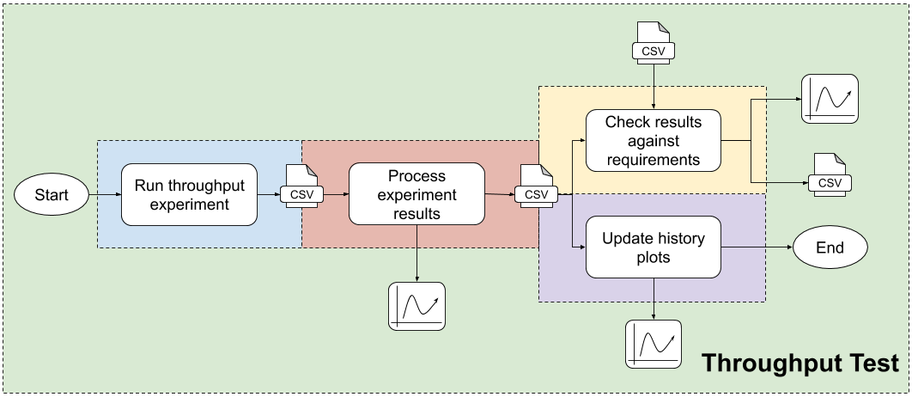
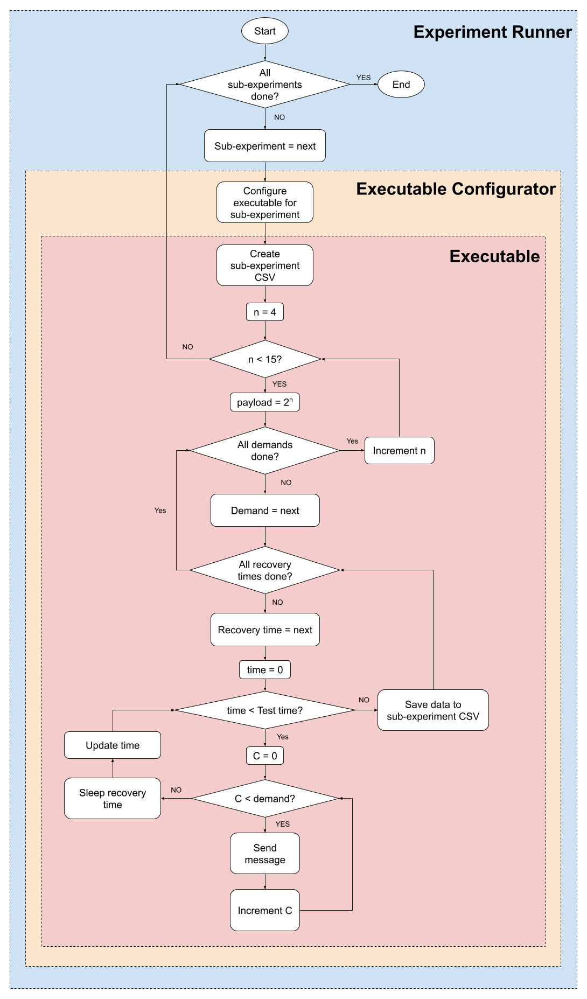
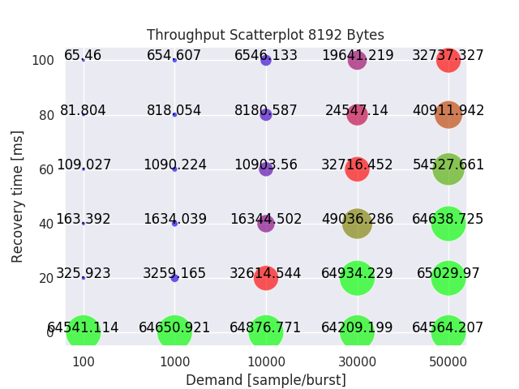
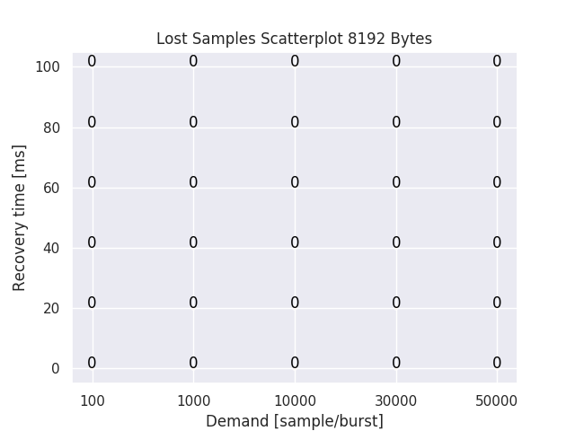
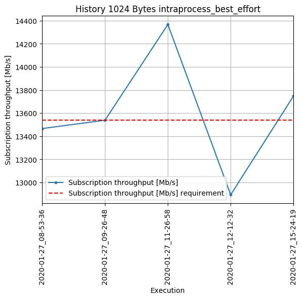
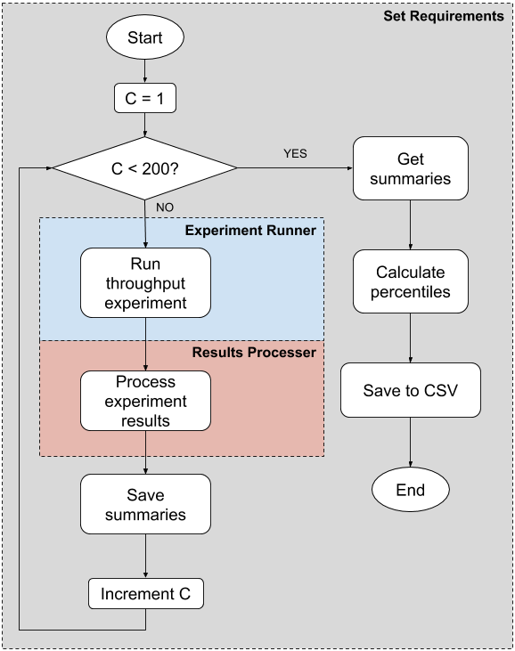

# Throughput Performance Test Specification

Performing a throughput test consists of a sequence of steps, from running an experiment to analyzing and presenting the results.
This document describes, for each of those steps, what are the inputs and outputs, and how the operation should be performed.
The steps involved in running a Throughput Performance Test are:

1. [Run a throughput experiment](#run-a-throughput-experiment): This step consists in taking measurements for different test cases (henceforth referred to as sub-experiments).
It outputs CSV files with all the taken measurements.
1. [Process experiment results](#process-experiment-results): Taking the measurements CSV files from the previous step, create summaries (as CSV files), an plot results in the form of histograms.
1. [Check the results against requirements](#check-the-results-against-requirements): Use the summaries to validate results against requirements, saving the results as "check" plots and CSV files.
1. [Update history plots](#update-history-plots): Use the summaries to create historical plots that use data from different experiments to illustrate Fast-RTPS' throughput performance throughout the development.

This, can be represented in the following diagram:

_Figure 1: Throughput test operation flow_

## Run a Throughput Experiment

Running a throughput experiment consists on measuring the maximum amount of data that can traverse a system, i.e. how much data does the receiver receive per time unit.

Since different test configurations yield very different throughput, some test cases are outline to try to characterize Fast-RTPS performance in a wide range of scenarios.
To do that, two sets of test parameters are defined and modified:

###### Fast-RTPS configuration parameters

This set of parameters configures the behaviour of the middleware. The parameters considered are:

* __Transport layer__
* __Reliability__
* __Security__

###### Throughput test configuration parameters

This set of parameters configures the operation of the test when measuring data. The parameters considered are:

* __Payload__: the size of the messages sent.
* __Burst size (demand)__: The number of messages to send, as fast as possible, between recovery times.
* __Recovery time__: The amount of time to rest between bursts. This is to let the middleware sometime to recover.
* __Test time__: The duration of the sending of messages. Before sending a ew burst, the test checks whether there is time left to do it.

#### Sub-experiments

Attending to the [Fast-RTPS configuration parameters](#fast-rtps-configuration-parameters), 10 sub-experiments are defined:

|| Name | Transport | Reliability | Security |
|-|-|-|-|-|
| 1 | intraprocess_best_effort | intra-process | BEST EFFORT | NO |
| 2 | intraprocess_reliable | intra-process | RELIABLE | NO |
| 3 | interprocess_best_effort | UDPv4 | BEST EFFORT | NO |
| 4 | interprocess_best_effort_security | UDPv4 | BEST EFFORT | YES |
| 5 | interprocess_best_effort_tcp | TCPv4 | BEST EFFORT | NO |
| 6 | interprocess_best_effort_tcp_security | TCPv4 | BEST EFFORT | YES |
| 7 | interprocess_reliable | UDPv4 | RELIABLE | NO |
| 8 | interprocess_reliable_security | UDPv4 | RELIABLE | YES |
| 9 | interprocess_reliable_tcp | TCPv4 | RELIABLE | NO |
| 10 | interprocess_reliable_tcp_security | TCPv4 | RELIABLE | YES |

For each sub-experiment, the following combinations of [Throughput test configuration parameters](#throughput-test-configuration-parameters) are tested:

| Payload [B] | Burst size (demand) | Recovery time [ms] | Test time [s] |
|-|-|-|-|
| $2^n, n \in \N \wedge n \in [4, 14]$ | 100, 1000, 10000, 30000, 50000 | 0, 20, 40, 60, 80, 100 | 1 |

The combination of all those scenarios yields 3300 test cases, 330 for each sub-experiment.

### Experiment Stack
The experiment is perform using three different agents:

* __Executable__: Fast-RTPS' `TrhoughputTest`.
It is use to perform each sub-experiment.
It takes a Fast-RTPS configuration (in the form of a Fast-RTPS XML file), a payload-demand configuration (as a CSV file as specified in [TODO](TODO)), and a recovery times configuration (as a CSV file as specified in [TODO](TODO)), and measures throughput for all the defined test cases.

* __Executable configurator__: Fast-RTPS' `throughput_tests.py`.
A python utility to configure and launch `ThroughputTest`.
This is used, in combination with CMake and `c-test`, to create a series of `performance.throughput` tests, one for each sub-experiment.

* __Experiment runner__: [throughput_run_experiment.bash](throughput_run_experiment.bash).
Utility to execute a throughput experiment.
Under the hood, this runs the following command (and copies the results to the specified directory):

    ```bash
    colcon test \
        --packages-select fastrtps \
        --ctest-args -R performance.throughput \
        --timeout 3600
    ```

    `colcon test` in turn calls to the executable configurator `throughput_tests.py` once for each sub-experiment type described in [Sub-experiments](#sub-experiments).

A throughput experiment workflow can be represented as follows:

_Figure 2: Throughput experiment workflow_

### Throughput Executable Specifications [TODO]

### Throughput Measurements CSV Specification

Each execution of `ThroughputTest` produces a CSV file with the following characteristics:

* The measurements CSV file must be a comma separated file
* It must have a header with the following columns:
    * Payload [Bytes]
    * Demand [sample/burst]
    * Recovery time [ms]
    * Sent [samples]
    * Publication time [us]
    * Publication sample rate [Sample/s]
    * Publication throughput [Mb/s]
    * Received [samples]
    * Lost [samples]
    * Subscription time [us]
    * Subscription sample rate [Sample/s]
    * Subscription throughput [Mb/s]
* It must have one entry per combination of payload, demand, and recovery time.
* The floating point precision must be 3 digits.

##### Measurements CSV example

```
Payload [Bytes],Demand [sample/burst],Recovery time [ms],Sent [samples],Publication time [us],Publication sample rate [Sample/s],Publication throughput [Mb/s],Received [samples],Lost [samples],Subscription time [us],Subscription sample rate [Sample/s],Subscription throughput [Mb/s]
16,1000,0,68000,1009243.093,67377.226,8.624,68000,0,1008973.053,67395.259,8.627
[...]
1024,1000,10,63000,1003405.113,62786.206,514.345,62854,146,1003199.694,62653.528,513.258
[...]
```

### How To Run An Experiment

[throughput_run_experiment.bash](throughput_run_experiment.bash) utility can be used to execute an experiment as illustrated in _Figure 2_.

```bash
bash throughput_run_experiment.bash \
    -c <fastrtps_ws> \
    -r <experiment_results_dir>
```

_Note_: `fastrtps_ws` is expected to be a `colcon` workspace with Fast-RTPS built and installed.
This is because [throughput_run_experiment.bash](throughput_run_experiment.bash) executes a `colcon test` command to run the experiment.

## Process Experiment Results

Processing throughput experiment results consist on three tasks:

* [Create sub-experiment summaries](#create-sub-experiment-summaries)
* [Create sub-experiment throughput scatter plots](#create-sub-experiment-throughput-scatter-plots)
* [Create sub-experiment lost samples scatter plots](#create-sub-experiment-lost-samples-scatter-plots)

### Create sub-experiment summaries

For each sub-experiment measurements CSV file, a sub-experiment summary must be created as a CSV upholding the following:

#### Latency Summary CSV Specification

* The summary CSV file must be a comma separated file
* It must have a header with the following columns:
    * Payload [Bytes]
    * Demand [sample/burst]
    * Recovery time [ms]
    * Sent [samples]
    * Publication time [us]
    * Publication sample rate [Sample/s]
    * Publication throughput [Mb/s]
    * Received [samples]
    * Lost [samples]
    * Subscription time [us]
    * Subscription sample rate [Sample/s]
    * Subscription throughput [Mb/s]
* It must have one entry per payload, being the one amongst all the payload measurements with the maximum subscription throughput.
* The floating point precision must be 3 digits.

##### Summary CSV example

```
Payload [Bytes],Demand [sample/burst],Recovery time [ms],Sent [samples],Publication time [us],Publication sample rate [Sample/s],Publication throughput [Mb/s],Received [samples],Lost [samples],Subscription time [us],Subscription sample rate [Sample/s],Subscription throughput [Mb/s]
16,30000,0,1830000,1002619.284,1825219.232,233.628,1830000,0,1002608.786,1825238.344,233.631
32,30000,0,1860000,1015109.505,1832314.634,469.073,1860000,0,1015109.223,1832315.143,469.073
64,30000,0,1830000,1000708.825,1828703.769,936.296,1830000,0,1000684.363,1828748.472,936.319
128,30000,0,1830000,1010733.358,1810566.541,1854.020,1830000,0,1010722.116,1810586.679,1854.041
256,30000,0,1800000,1006023.421,1789222.759,3664.328,1800000,0,1006027.413,1789215.659,3664.314
512,50000,0,1800000,1026924.825,1752806.005,7179.493,1800000,0,1026921.466,1752811.739,7179.517
1024,50000,20,1750000,1025456.571,1706556.912,13980.114,1750000,0,1025455.698,1706558.365,13980.126
2048,50000,0,1650000,1013091.783,1628677.704,26684.256,1650000,0,1013095.812,1628671.227,26684.149
4096,1000,0,1421000,1000325.860,1420537.104,46548.160,1421000,0,1000327.825,1420534.314,46548.068
8192,50000,20,1000000,1007777.156,992282.862,65030.250,1000000,0,1007781.488,992278.596,65029.970
```

### Create sub-experiment throughput scatter plots

For each payload in each sub-experiment measurements CSV file, a throughput scatter plot must be created, setting the demand in the X-axis, and the recovery time in the Y-axis.
Then, the throughput it represented as a colored circle which gets bigger with the throughput, which is displayed on top of each circle.
This is done to visualize which [Throughput test configuration parameters](#throughput-test-configuration-parameters) are better for that sub-experiment.


_Figure 3: Throughput Scatter Plot_

By analyzing these figures, it is possible to reduce the number of test cases without missing the higher possible throughput.

### Create sub-experiment lost samples scatter plots

Similarly to the [throughput scatter plots](#create-sub-experiment-throughput-scatter-plots), the lost samples can be represented in a demand/recovery time graph.


_Figure 4: Lost Samples Scatter Plot_

### How To Process Experiment Results

[throughput_process_results.py](throughput_process_results.py) utility can be used to process the results of a throughput experiment.
It takes a sub-experiment measurements CSV as input, and produces scatter plots and a summary of that sub-experiment.

```bash
python3 throughput_process_results.py \
    --plots_directory <directory> \
    --raw_csv <sub-experiment_measurements_csv> \
    --output_csv <summary_filename>
```

## Check The Results Against Requirements

To evaluate whether the throughput performance of Fast-RTPS is satisfactory, experiment results must be checked against a set of requirements.
For every sub-experiment and payload, there must be a requirement for each of the following categories:

* __Subscription throughput__: The experiment subscription throughput must always be above the limit set by the requirement.
* __Lost samples__: The experiment lost samples must always be below the limit set by the requirement.

The sub-experiment summaries are used to check experiment's data against requirements extracted from a requirements CSV file (in the form described in [Requirements CSV specification](#requirements-csv-specification)).
Checking throughput results against requirements consist on two tasks:

* [Create sub-experiment check reports](#create-sub-experiment-check-reports)
* [Create sub-experiment check plots](#create-sub-experiment-check-plots)

### Create sub-experiment check reports

A sub-experiment check report is a CSV file containing two requirement checks for each payload (subscription throughput and lost samples).
The sub-experiment check report CSV files must uphold the [Check report CSV specification](#check-report-csv-specification).

### Create sub-experiment check plots

For each sub-experiment and check, there must be a check plot that displays the sub-experiment results alongside their corresponding requirements.
These plots must have the following form:


_Figure 5:Check plot_

### Requirements CSV specification

* The requirements CSV file must be a comma separated file
* It must have a header with the following columns:
    * Experiment type
    * Payload [Bytes]
    * Lost [samples]
    * Subscription throughput [Mb/s]
* It must have one entry per combination of sub-experiment and payload.
* The floating point precision must be 3 digits.

##### Requirements CSV example

```
Experiment type,Payload [Bytes],Lost [samples],Subscription throughput [Mb/s]
intraprocess_best_effort,16,0.000,225.004
[...]
intraprocess_best_effort,1024,0.000,13535.979
[...]
intraprocess_reliable,16,0.000,196.188
[...]
intraprocess_reliable,1024,0.000,11590.021
[...]
```

### Check report CSV specification

A check report is a CSV file containing information about how a certain sub-experiment has performed relative to a set of requirements.
The specifications for such file are:

* It must be a comma separated file
* It must have a header with the following columns:
    * Check: Lost [samples], or Subscription throughput [Mb/s]
    * Payload [Bytes]: The payload in Bytes
    * Requirement: The limit
    * Experiment: The data
    * Difference: The absolute difference between `Requirement` and `Experiment`.
    * Percentage over requirement: How much of the requirement does the difference represent (in percentage).
    * Status: Either passed or failed.
* It must have one entry per payload and check.
* The floating point precision must be 3 digits.

##### Check report CSV example

```
Check,Payload [Bytes],Requirement,Experiment,Difference,Percentage over requirement,Status
Lost [samples],16,58.800,2488.000,2429.200,4131.293,failed
[...]
Lost [samples],1024,143.080,918.000,774.920,541.599,failed
[...]
Subscription throughput [Mb/s],16,9.364,9.263,0.101,-1.079,failed
[...]
Subscription throughput [Mb/s],1024,555.954,547.765,8.189,-1.473,failed
```

### How To Check Results Against Requirements

[throughput_check_experiment.py](throughput_check_experiment.py) utility can be used to check the results of a throughput experiment against a set of requirements.
It takes a set of sub-experiment summaries and a requirements CSV file as input, and produces check reports and plots for each sub-experiment.

```bash
python3 throughput_check_experiment.py \
    --requirements <requirements_csv> \
    --experiment_directory <dir_with_summaries> \
    --plots_directory <dir_for_plots> \
    --print_summaries
```

## Update History Plots

As a last step of the throughput testing process, history plots must be created to visualize Fast-RTPS throughput performance throughout the development process.
There are two types of such plots:

* [Magnitude history plots](#magnitude-history-plots)
* [Payload history plots](#payload-history-plots)

### Magnitude history plots

Using summaries from different throughput tests, magnitude history plots must be created.
There must be one magnitude history plot (in the form of _Figure 6_) for each of the following magnitudes:

* Subscription throughput
* Lost samples

TODO: Magnitude history plot

_Figure 6: Magnitude history plot_

### Payload history plots

Using summaries from different throughput tests, one plot for each sub-experiment, requirement, and payload must be created in the following form:


_Figure 7: Payload history plot_

### How To Update History Plots

[throughput_plot_history.py](throughput_plot_history.py) utility can be used to generate throughput test history plots.
It takes a set of experiment results and a requirements CSV file as input, and produces history magnitude and payload plots.

```bash
python3 throughput_plot_history.py \
    --requirements <requirements_csv> \
    --experiments_results <dir_with_experiment_results_dirs> \
    --plots_directory <dir_for_plots>
```

## Set Throughput Requirements

Although requirements may come from application specifications, for the purpose of monitoring throughput performance as development happens, a method to extrapolate requirements based on testing environment is presented here.

This is necessary because although at eProsima there are not hard application driven throughput requirements, there is an interest in monitoring how Fast-RTPS throughput performance evolves with development, and therefore there is a need of a way to determine if Fast-RTPS is getting better or worse.
To do that, performance requirements must be set for the different cases based on how the library performs, in a specific hardware setup, at a given point in time.
This is a characterization of the performance state for a specific software version.
That characterization is used as reference (requirements) to monitor Fast-RTPS evolution.

This is done by selecting a specific Fast-RTPS commit, and collecting throughput data several times (up to 200).
Then, requirements are set for some of the measured magnitudes, fixed as the measured data at a given percentile, saving them into a CSV file.
Requirements are set for (for each experiment type and payload):

| Magnitude | Percentile |
|-|-|
| Subscription throughput | 99 |
| Lost sample | 99 |

The method for setting requirements is illustrated in the following diagram:

_Figure 8: Set requirements process_

As long as a experiment execution is within those requirements, we consider Fast-RTPS performance as good enough.

### Utilities

Two utilities are created to perform this task:

* [throughput_determine_requirements.py](throughput_determine_requirements.py): Script to determine throughput requirements based on a set of experiment results.
* [throughput_extrapolate_requirements.bash](throughput_extrapolate_requirements.bash): Script to run several throughput experiments, and then use [throughput_determine_requirements.py](throughput_determine_requirements.py) to derive requirements.

#### How To Set Throughput Requirements

To derive throughput requirements for a given set up, run:
```bash
bash throughput_extrapolate_requirements.bash \
    -c <fastrtps_ws> \
    -o requirements.csv \
    -r runs_for_requirements
```

This produces a requirements CSV file as specified in [Requirements CSV specification](#requirements-csv-specification)
After that, the CSV file can be edited to adjust requirements at will.
