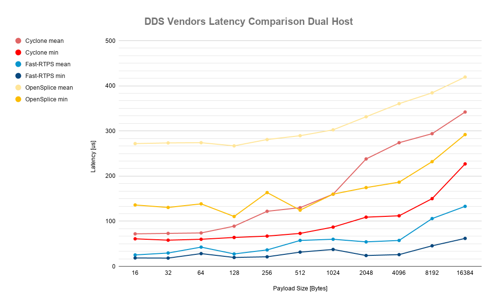

# Experiments' log
With the purpose of replicability, this file details the configuration used to perform each experiment.

## Last comparison (experiment 2019-09-23_08-41-33)

## 2019-09-23_08-41-33

### Testing environment
* Location: eProsima’s facilities
* Machines: PowerEdge R330 e34s
    * Architecture: x86_64
    * CPU(s): 8
    * Thread(s) per core: 2
    * Model name: Intel(R) Xeon(R) CPU E3-1230 v6 @ 3.50GHz
    * Kernel: 4.15.0-64-generic
    * OS: Ubuntu 18.04.2 LTS bionic

### Test configuration
* Transport: UDPv4
* Reliability: RELIABLE
* History kind: KEEP_LAST
* History depth: 1
* Durability: VOLATILE
* Message sizes [Bytes]: 16, 32, 64, 128, 256, 512, 1024, 2048, 4096, 8192, and 16384
* Number of messages per test: 10000

### Software versions
* Fast-RTPS commit: 010ac536619f02c63b380658059d1f98ed50e964
* CycloneDDS commit: 801c4b14566a15c08261818a1192b1d16d055d8e
* OpenSplice version: v6.9

### Software patches
To set the appropriate reliability to OpenSpice's `Roundtrip` example, [opensplice_roundtrip_implementation.patch](../patches/opensplice_roundtrip_implementation.patch) has to be applied to `ìmplementation.cpp`.