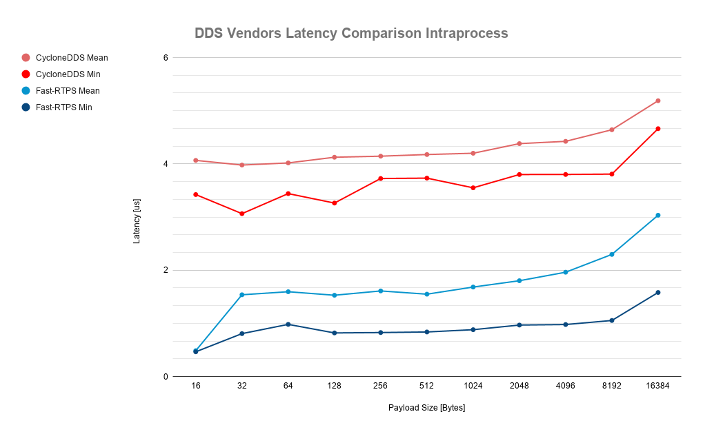

# Experiments' log
With the purpose of replicability, this file details the configuration used to perform each experiment.

## Last comparison (experiment 2019-11-15_11-57-32)


## Experiment 2019-11-15_11-57-32

### Testing environment
* Location: eProsima’s facilities
* Machine: PowerEdge R330 e34s
    * Architecture: x86_64
    * CPU(s): 8
    * Thread(s) per core: 2
    * Model name: Intel(R) Xeon(R) CPU E3-1230 v6 @ 3.50GHz
    * Kernel: 4.15.0-64-generic
    * OS: Ubuntu 18.04.2 LTS bionic

### Test configuration
* Transport: Intraprocess
* Reliability: RELIABLE
* History kind: KEEP_LAST
* History depth: 1
* Durability: VOLATILE
* Message sizes [Bytes]: 16, 32, 64, 128, 256, 512, 1024, 2048, 4096, 8192, and 16384
* Number of messages per test: 10000

### Software versions
* Fast-RTPS commit: b5ae9e9c9ea7ce49c64c0ef3f6c96a3dc563b16f (v1.9.3) with a cherry-pick of 24f462d9b8ebbe82e5180f9e8788c1547a65bfb6, which enables intra-process latency testing for Fast-RTPS.
* CycloneDDS commit: 9e61bff9b9df564338a0d8c57442c372668719c0.
* A [*RoundtripIntraprocess* application](#cyclonedds-roundtripintraprocess) that enables the testing of CycloneDDS' intra-process feature by running publisher and subscriber in the same process has been created.

### Run the experiments
##### Fast-RTPS
Fast-RTPS' latency test is configured using [latency_intraprocess.xml](fastrtps/2019-11-15_11-57-32/latency_intraprocess.xml). The test is executed with one command.

```bash
${PATH_TO_BUILD_DIR}/LatencyTest both --samples 10000 --xml latency_intraprocess.xml --export_raw_data measurements.csv
```
##### CycloneDDS
*RoundtripIntraprocess* is run for a specific payload, generating a CSV file with all the measurements taken. To run the application for several payloads, the following `Bash` script can be used.
```bash
for payload in 16 32 64 128 256 512 1024 2048 4096 8192 16384;
do
    ${PATH_TO_BUILD_DIR}/RoundtripIntraprocess ${payload} 10000 0 measurements_${payload}.csv
done
```

## CycloneDDS' *RoundtripIntraprocess*
The C code for the *RoundtripIntraprocess* application can be found in [ping_pong.c](cyclonedds/roundtrip_intraprocess/ping_pong.c). To use this code, place it in CycloneDDS' `examples/roundtrip/` directory, and apply patches [CMakeLists.export.patch](cyclonedds/roundtrip_intraprocess/CMakeLists.export.patch) and [CMakeLists.txt.patch](cyclonedds/roundtrip_intraprocess/CMakeLists.txt.patch).


