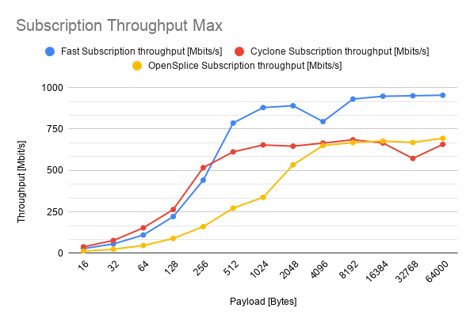

# Throughput tests
This directory contains throughput results obtained by running the throughput test tools that each implementation vendor provides. The experiments are performed for several case scenarios:

* [Local host configuration](localhost): the publisher and the subscriber run in the same machine.
* [Dual host configuration](dualhost): the publisher and the subscriber run in separate machines connected to a local network via ethernet.

To replicate the results exposed here, look at:
* [Local host experiments log](localhost/README.md)
* [Dual host experiments log](dualhost/README.md)

## Local host comparison

## Dual host comparison

