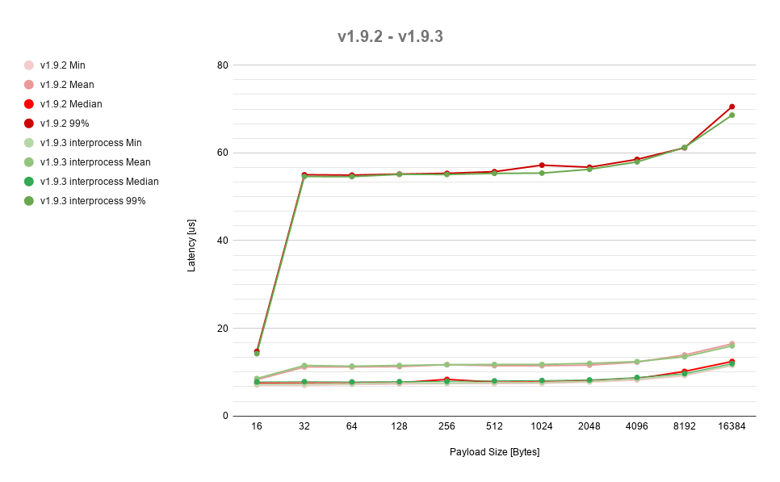
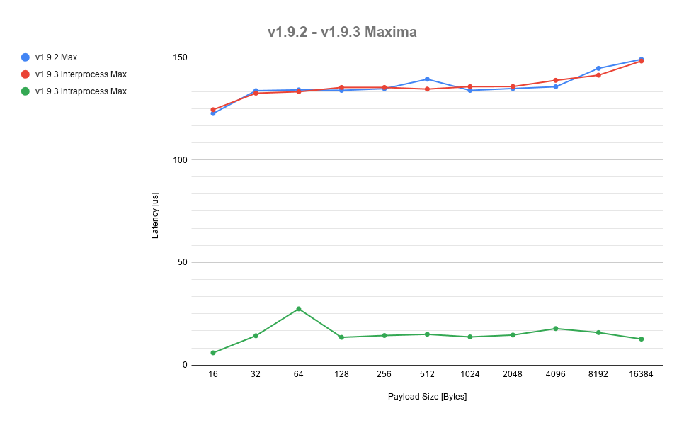
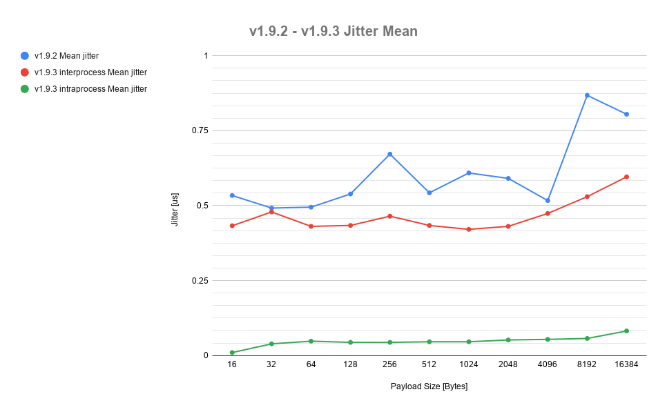
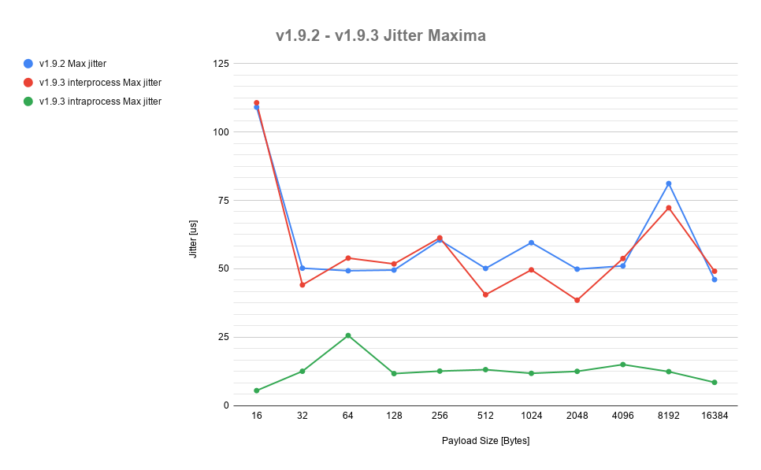

# Fast-RTPS cross-version comparison
To keep track of our own library's progress, we execute cross-version performance comparisons in terms of [Latency](latency).

## Most recent comparison (v1.9.2 - v1.9.3)
We have performed latency performance test for both Fast-RTPS `v1.9.2` and `v1.9.3` (checkout the [release notes](https://eprosima-fast-rtps.readthedocs.io/en/latest/notes.html)). We wanted, not only to keep track of the performance evolution in terms of latency in the local host test case, but also to compare the behaviour in the intra-process test case. We were specially interested in the latter, since `v1.9.3` incorporates an intra-process delivery mechanism, which was lacking in previous Fast-RTPS versions. To do this, we had to [modify our Latency test](https://github.com/eProsima/Fast-RTPS/pull/863) to allow for running both publisher and subscriber agents in the same process. The results are as follows:

###### Local host (different process)

*Figure 1: Local host comparison (min, mean, median, and 99% percentile)*

*Figure 2: Local host comparison (maxima)*

###### Intra-process

*Figure 3: Intra-process comparison (min, mean, median, and 99% percentile)*

###### Jitter

*Figure 4: Jitter mean*

*Figure 5: Jitter maxima*

