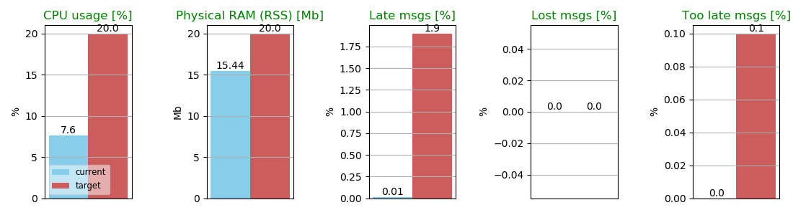

# iRobot performance test RPi 3b+ executions Log

This directory contains the results of executing iRobot's performance tests in a RaspberryPi 3 model b+ with Raspbian.
In this document, the specifics of each experiment are detail, along side the specifications of the board used for them.

1. [Experiments log](#experiments-log)
2. [RPi specifications](#rpi-specifications)

## Experiments log

### Summary

| Experiment | Toplogy | CPU usage [%] | Physical RAM (RSS) [Mb] | Late msgs [%] | Lost msgs [%] | Too late msgs [%] | Passed categories |
|-|-|-|-|-|-|-|-|
| 2019-12-11_08-05-42 | mont_blanc | 14.12 | 21.41 | 0.03 | 0 | 0.0 | 4/5 |
| 2019-12-11_08-05-42 | eprosima | 7.6 | 15.44 | 0.01 | 0 | 0.0 | 5/5 |

## [2019-12-11_08-05-42](2019-12-11_08-05-42)

#### Software versions

| | Repository | Branch | Commit |
|-|-|-|-|
| ROS 2 | https://github.com/ros2/ros2 | master | 531a84a621771a6f4b947d1acad65eb9132f38de |
| Fast-RTPS | https://github.com/eProsima/Fast-RTPS | irobot_test | eec2623a8abac7c2da252f9f752ca81d8149ccf5 |
| ros2-performance | https://github.com/eProsima/ros2-performance | feature/extend_benchmark_options | d3827884f9555d49d70b43be423916e6a965439c |
| rmw_fastrtps | https://github.com/eprosima/rmw_fastrtps/branches | feature/load_profiles_from_nodename_and_topic | 10dd60e09de4fb3efb59826032b26dce24ce94bea |

#### Test configuration

| Topology | Duration [s] | ipc | wait-pdp | xml file |
|-|-|-|-|-|
| mont_blanc | 60 | off | off | [fastrtps_mont_blanc_whitelist_dynamic.xml](../../../scripts/irobot_tests/xml/fastrtps_mont_blanc_whitelist_dynamic.xml)
| [eprosima](../../../scripts/irobot_tests/eprosima.json) | 60 | off | off | [fastrtps_eprosima_dynamic.xml](../../../scripts/irobot_tests/xml/fastrtps_eprosima_dynamic.xml)
#### Results

###### Fast-RTPS Mont Blanc topology


###### Fast-RTPS eProsima topology



## RPi specifications

| Date | Board model | Serial | Architecture | CPUs | CPU max MHz | Kernel version | OS |
|-|-|-|-|-|-|-|-|
| 2019-12-10 | Raspberry Pi 3 Model B Plus Rev 1.3 | 00000000290e272d | armv7l | 4 | 1400 | 4.19.75-v7+ | Raspbian GNU/Linux 10 (buster) |

To see your board's specifications:

###### Board model

```
pi@raspberrypi:~ $ cat /proc/cpuinfo
Hardware    : BCM2835
Revision    : a020d3
Serial      : 00000000290e272d
Model       : Raspberry Pi 3 Model B Plus Rev 1.3
```

###### Processor related specs

```
pi@raspberrypi:~ $ lscpu
Architecture:        armv7l
Byte Order:          Little Endian
CPU(s):              4
On-line CPU(s) list: 0-3
Thread(s) per core:  1
Core(s) per socket:  4
Socket(s):           1
Vendor ID:           ARM
Model:               4
Model name:          Cortex-A53
Stepping:            r0p4
CPU max MHz:         1400.0000
CPU min MHz:         600.0000
BogoMIPS:            38.40
Flags:               half thumb fastmult vfp edsp neon vfpv3 tls vfpv4 idiva idivt vfpd32 lpae evtstrm crc32
```

###### Kernel version

```
pi@raspberrypi:~ $ uname -r
4.19.75-v7+
```

###### Operating system and distribution

```
pi@raspberrypi:~ $ lsb_release -a
No LSB modules are available.
Distributor ID: Raspbian
Description:    Raspbian GNU/Linux 10 (buster)
Release:        10
Codename:       buster
```


```bash
```
